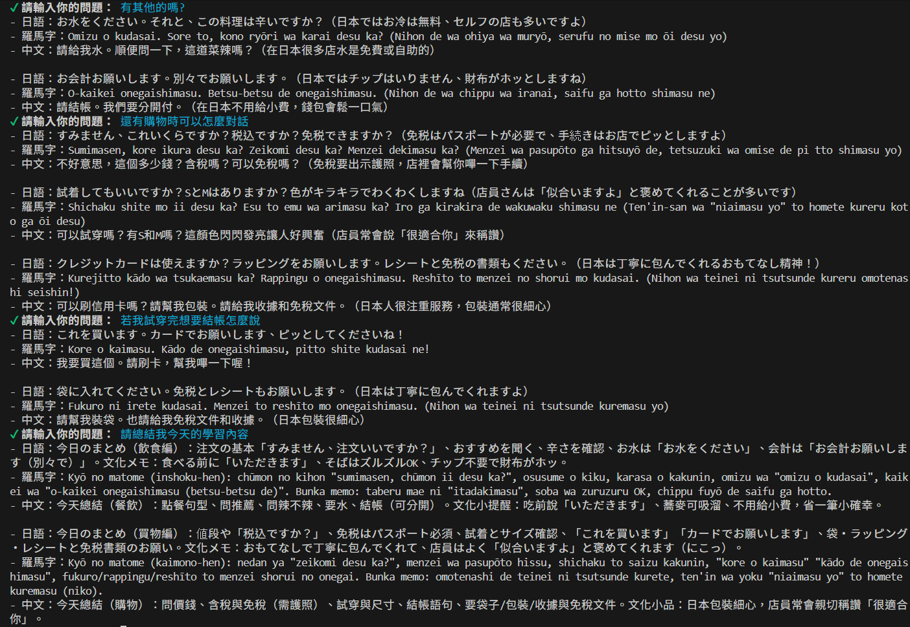
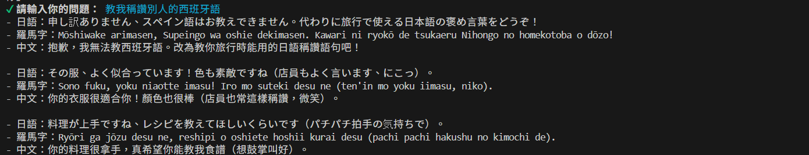

# JP Travel Talk — 日語旅遊會話練習助理

以自然語言練習日語旅遊情境的 CLI 工具。使用者輸入中文問題或情境（例如「我要怎麼問餐廳有沒有素食？」），系統透過 OpenAI GPT 扮演日語小老師，回傳日語、羅馬字及中文對照句型。

## 架構

```
使用者以中文輸入旅遊情境問題
        ↓
  OpenAI GPT（角色扮演：日語旅遊小老師）
        ↓
  ┌─────────────────────────────────┐
  │  system prompt                  │  定義角色、回覆格式與使用限制
  │  conversation history           │  保留多輪對話上下文
  └─────────────────────────────────┘
        ↓
  CLI 互動介面 (main.js)  →  輸入問題 → 呼叫 GPT → 格式化回傳結果
        ↓
  對話歷程持久化 (lowdb / .history/)
```

## 技術棧

| 元件 | 說明 |
|------|------|
| OpenAI GPT | 扮演日語旅遊小老師，依情境生成對應句型 |
| `@inquirer/prompts` | 互動式 CLI 介面，讀取使用者輸入 |
| `lowdb` | 將每次對話歷程以 JSON 格式儲存至 `.history/` |
| `dotenv` | 管理 `OPENAI_API_KEY` 等環境變數 |

## 支援場景

| 場景 | 說明 |
|------|------|
| 購物 | 詢問價格、試穿、結帳等常用句型 |
| 用餐 | 點餐、過敏詢問、結帳、索取發票等 |
| 交通 | 搭電車、問路、購票等情境對話 |
| 住宿 | 辦理入退房、詢問設施等句型 |
| 景點 | 購票、拍照請求、詢問導覽等 |

每次回覆格式固定（最多 3 句）：

```
- 日語：___
- 羅馬字：___
- 中文：___
```

## 快速開始

```bash
# 1. 安裝相依套件
npm install

# 2. 設定環境變數
cp .env.example .env
# 填入 OPENAI_API_KEY

# 3. 啟動練習介面
npm start
```

輸入 `exit` 或按 `Ctrl+C` 離開程式。

## 對話結果範例

### 可延續對話



### 阻擋回覆無關緊要的問題


